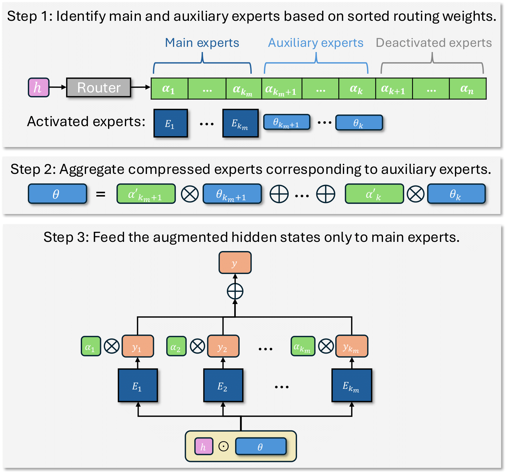

# Efficiently Editing Mixture-of-Experts Models with Compressed Experts

This is the official implementation of compressed experts in the paper ["Efficiently Editing Mixture-of-Experts Models with Compressed Experts"](https://arxiv.org/pdf/2503.00634).



## Abstract
Mixture-of-Experts (MoE) models have become a key approach for scaling large language models efficiently by activating only a subset of experts during training and inference. Typically, the number of activated experts presents a trade-off: fewer experts reduce computational costs, while more experts improve performance. Recent studies reveal that not all activated experts contribute equally to model performance, with some providing minimal utility, particularly when finetuning pretrained MoE models for specialized downstream tasks. The co-existence of significant and redundant  parameters in experts provides us an opportunity to reduce the number of activated experts while maintaining model performance. In this work, we propose the concept of compressed experts, lightweight modules that serve as compact representations of full experts. Our approach preserves the most important experts while replacing other auxiliary activated experts with compressed experts. The reduction of active parameters significantly lowers inference costs while achieving comparable performance. Extensive experiments on models including Phi-MoE and OLMoE demonstrate that compressed experts recover over 90\% of full expert performance across various tasks while reducing more than 30\% active parameters and saving 20\% in inference costs. This approach enables efficient deployment of MoE models in resource-constrained settings and facilitates scaling to larger models with manageable overhead.

## Setup
Please use the following commands to create a virtual environment and install all the requirements for the project.
```
conda create -n ce python=3.13.2
git clone https://github.com/yifei-he/Compressed-Experts
cd Compressed-Experts
conda activate ce
pip install -r requirements.txt
```

## Running experiments

The SFT experiments in the paper can be easily run by 
```
python run_sft.py
```
Feel free to pass in any training parameters.

### Model configurations

In the folder `model_configs`, we provide two configurations for OLMoE. `config_olmoe.json` is the original OLMoE configuration which does not contain compressed experts, while `config_olmoe_ce.json` includes compressed experts. One can choose the number of experts to be compressed by setting the `n_ce` parameter. In the provided file, this is set to be half of the total activated experts as shown in the paper. The detailed implementation of compressed experts is done in the `OlmoeCEMLP` and `OlmoeSparseCompressedMoeBlock` in `modeling/modeling_olmoe.py`.

### Datasets
We provide implementation and preprocessing of three SFT datasets used in the paper: `MathInstruct`, `MagiCoder-Evol-Instruct-100K` and `TULU-3`. To select a dataset for training, pass in the argument `--task` and select among math, coding and general.


# Citation
If you find this repo useful, please cite our work as follows:
```
@misc{he2025efficientlyeditingmixtureofexpertsmodels,
      title={Efficiently Editing Mixture-of-Experts Models with Compressed Experts}, 
      author={Yifei He and Yang Liu and Chen Liang and Hany Hassan Awadalla},
      year={2025},
      eprint={2503.00634},
      archivePrefix={arXiv},
      primaryClass={cs.LG},
      url={https://arxiv.org/abs/2503.00634}, 
}
```